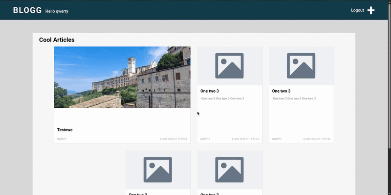
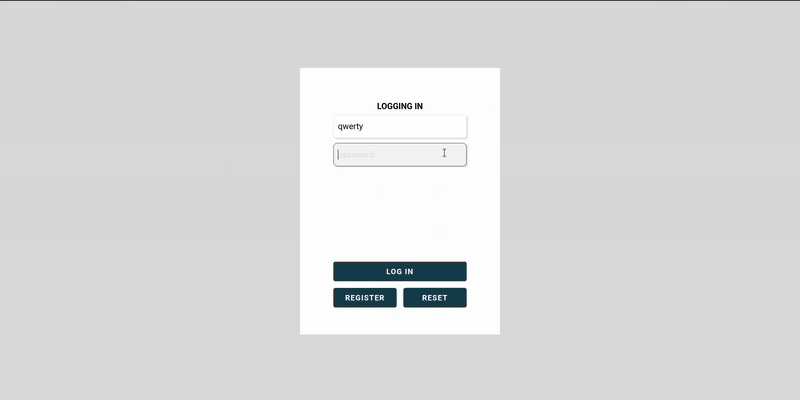
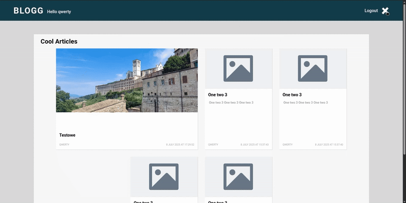
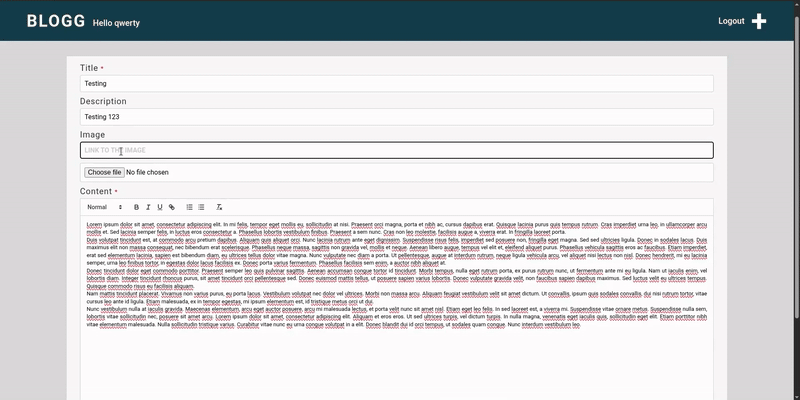
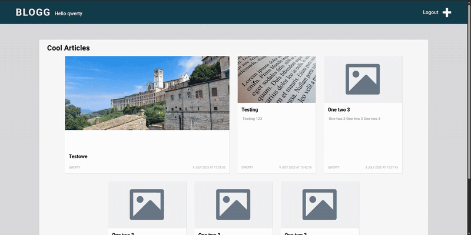

# Blog Platform – Documentation & Showcase

> *A small full-stack project for learning purposes.*

[](LICENSE)

## Table of Contents

1. [Introduction](#1-introduction)
2. [Tech Stack](#2-tech-stack)
3. [Setup](#3-setup)
4. [Running the Project](#4-running-the-project)
5. [API](#5-api)
6. [License](#6-license)

# 1. Introduction

This repository contains a minimal blog application built as a coding exercise. The project demonstrates a simple React frontend paired with a Node + Express backend. It allows users to register, log in and add articles with optional images.


*home page*


*login*


*adding a post to your blog*




*setting as main post*

# 2. Tech Stack

| Layer         | Technology        | Key Libraries                     |
| ------------- | ----------------- | --------------------------------- |
| **Front-end** | React + CRA       | axios, react-router-dom, ReactQuill |
| **Back-end**  | Node + Express    | passport, bcrypt, pg              |
| **Database**  | PostgreSQL        | SQL queries in `server/queries.sql` |

# 3. Setup

1. **Install dependencies**

   ```bash
   cd server && npm install
   cd ../client && npm install
   ```

2. **Install PostgreSQL and pgAdmin4** – follow the official guides for your system and create a database named `blog`.

3. **Create tables** – open pgAdmin4 and execute the SQL in `server/queries.sql`.

4. **Configure `.env.local`** – place the following in `server/.env.local`:

   ```bash
   DB_USER=
   DB_HOST=
   DB_NAME=
   DB_PASSWORD=
   DB_PORT=
   SESSION_KEY=session_key
   TOKEN_KEY=token_key
   ```

# 4. Running the Project

1. **Start the backend**

   ```bash
   cd server
   npm start
   ```

2. **Start the frontend**

   ```bash
   cd client
   npm start
   ```

The React app runs at `http://localhost:3000` and communicates with the Express server on port `8080`.

# 5. API

| Path | Method | Description |
| ---- | ------ | ----------- |
| `/is-authenticated` | GET | Check if the user is logged in |
| `/logout` | GET | Destroy the session cookie |
| `/data` | GET | Retrieve all articles |
| `/article/:id` | GET | Fetch a single article |
| `/article/:id/set-main` | PATCH | Mark article as main |
| `/login` | POST | Authenticate and set token cookie |
| `/register` | POST | Create a new user |
| `/article` | POST | Add a new article (auth required) |

# 6. License

This project is released under the [MIT License](LICENSE).